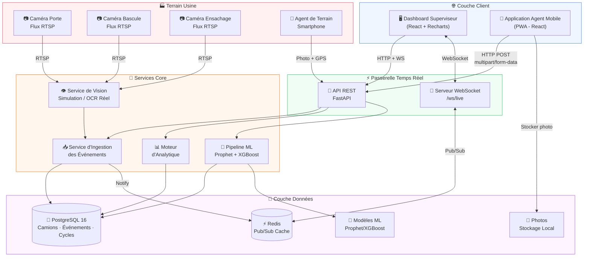
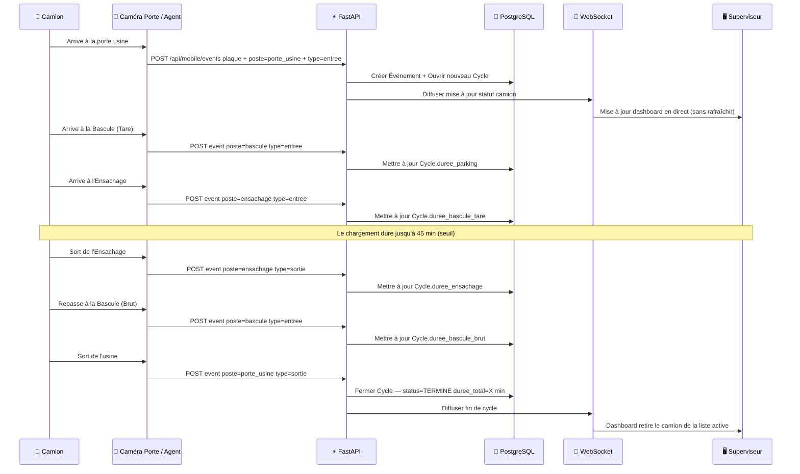
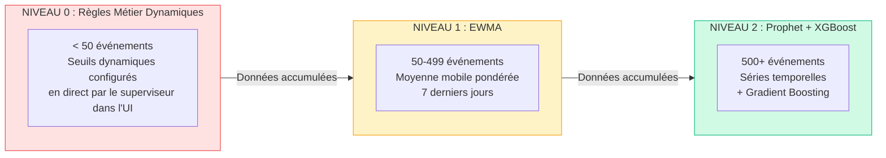
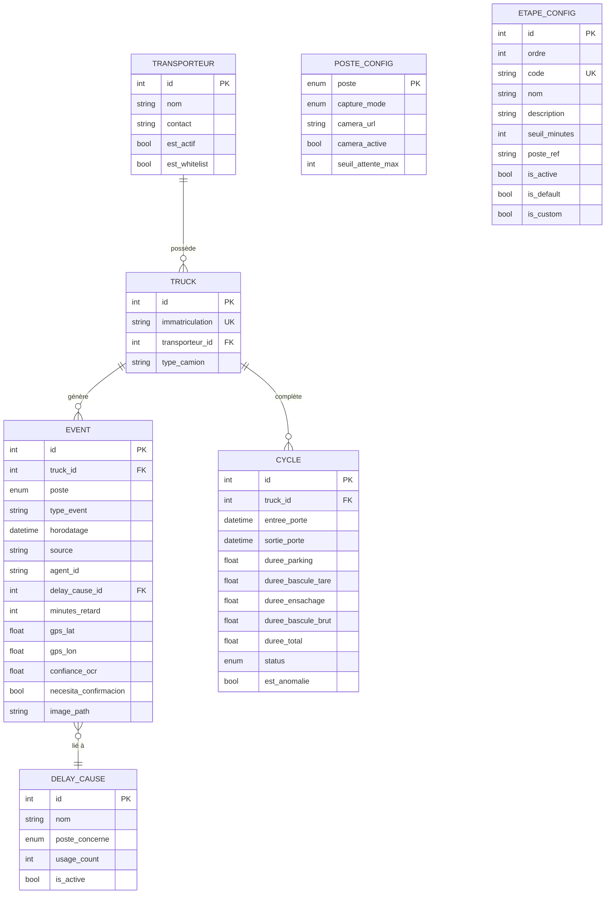

# 🏭 Smart Plant Truck Tracker
### LafargeHolcim Meknès — Plateforme de Logistique Intelligente

[](https://fastapi.tiangolo.com)
[](https://react.dev)
[](https://postgresql.org)
[](https://docker.com)
[](https://typescriptlang.org)

> **Chaque minute qu'un camion ciment attend dans votre usine, c'est de l'argent perdu.**
> Ce système suit chaque camion, à chaque porte, à chaque seconde — automatiquement.

---

## 🎓 Contexte du Projet

Ce projet a été réalisé dans le cadre d'un **stage d'initiation chez LafargeHolcim Meknès**, leader mondial des matériaux de construction. L'objectif était de concevoir et développer une solution complète de traçabilité des flux camions dans l'usine de cimenterie, en combinant **vision par ordinateur (OCR)**, **interface mobile terrain** et **analytique temps réel**.

---

## 🎯 Quel Problème Résout Ce Système ?

Dans une cimenterie comme **LafargeHolcim Meknès**, des dizaines de camions entrent et sortent chaque jour. Chaque camion traverse **6 étapes critiques** :

```
🚪 Porte Usine (Entrée) → 🅿️ Parking → ⚖️ Agence Logistique (Tare)
→ 📦 Expéditions / Ensachage → ⚖️ Agence Logistique (Brut) → 🚪 Porte Usine (Sortie)
```

Sans système de suivi, le superviseur n'a **aucune visibilité** sur :
- Combien de temps ce camion attend-il ?
- Quelle zone crée des goulots d'étranglement aujourd'hui ?
- Quel transporteur cause le plus de retards ?
- Pourquoi le camion `45231-أ-12` était-il en retard mardi dernier ?

**Cette plateforme répond à toutes ces questions — en temps réel.**

---

## 📸 Captures d'Écran

### 🖥️ Dashboard Superviseur

*Vue d'ensemble temps réel : camions en cours, KPIs, alertes, et poste bloquant*

### 📊 Statistiques et Analytiques

*Analyse détaillée des retards par zone, transporteurs, et causes*

### 📱 Interface Mobile Agent

*Saisie terrain : plaque, photo, GPS, signalement de retard*

---

## ✨ Fonctionnalités Clés

### 🖥️ Dashboard Superviseur
- **Suivi temps réel** des camions via WebSocket — pas besoin de rafraîchir la page
- **Timeline visuelle** du parcours de chaque camion dans l'usine
- **Alertes en temps réel** pour les camions dépassant les seuils d'attente
- **Configuration des caméras** par zone (Mode Bi : Caméra OCR + Agent Mobile)
- **Prédictions ETA** : heure estimée d'arrivée aux futures étapes

### 📊 Statistiques & Analytiques
- Filtre par **Aujourd'hui / 7 derniers jours / 30 derniers jours**
- Analyse du temps de cycle : moyenne, médiane, min, max vs objectif 120 min
- **Décomposition des retards par zone** avec graphiques de conformité
- **Analyse complète des causes de retard** avec barres de progression et % du retard global
- **Classement des transporteurs** avec minutes de retard cumulées
- Répartition des sources de capture : Caméra OCR vs Agent Mobile vs Hybride

### 📱 Interface Mobile Agent
- Les agents de terrain peuvent enregistrer les entrées/sorties depuis leur **smartphone**
- Capture photo optionnelle des plaques d'immatriculation
- **Géolocalisation GPS** attachée à chaque événement
- Signalement des retards avec sélection de cause + commentaire libre
- Fonctionne comme **Progressive Web App (PWA)** — installable sur n'importe quel téléphone
- **Mode hors-ligne** : les saisies sont stockées localement et synchronisées automatiquement

### 🤖 Système de Capture Bi-Mode

| Mode | Description | Idéal Pour |
|------|-------------|------------|
| **Caméra OCR** | L'IA lit la plaque automatiquement | Conditions normales |
| **Agent Mobile** | L'agent confirme/saisit la plaque manuellement | Conditions poussiéreuses |
| **Hybride** | La caméra tente d'abord, l'agent valide si incertain | Fiabilité maximale |

---

## 🏗️ Architecture du Système



---

## 🔄 Cycle de Vie Complet d'un Camion



---

## 🧠 Logique d'Entraînement Automatique (ML)

Le système intègre un **pipeline d'apprentissage automatique** qui s'améliore avec le temps :

### Architecture "Zero-to-Hero" à 3 Niveaux



### Comment ça marche

| Niveau | Données Requises | Modèle | Précision |
|--------|-----------------|--------|-----------|
| **0** | Aucune | Règles métier (seuils) | Basique |
| **1** | 50+ événements | EWMA (moyenne mobile) | Moyenne |
| **2** | 500+ événements | Prophet + XGBoost | Élevée |

### Entraînement Automatique

- Le modèle s'entraîne **automatiquement toutes les 6 heures**
- **Prophet** (Facebook) capture la saisonnalité journalière (modèle principal en production)
- **XGBoost** (expérimental) effectue une inférence dynamique basée sur les caractéristiques temporelles (`hour_sin`, `dow_sin`, etc.)
- Si XGBoost est activé via toggle, ses prédictions réelles s'affichent dans le système
- Les modèles sont persistés dans le dossier `models/` (volume Docker)

### Features Utilisées

- `hour_sin`, `hour_cos` — Saisonnalité horaire
- `dow_sin`, `dow_cos` — Saisonnalité hebdomadaire
- `is_weekend`, `is_morning_rush`, `is_afternoon_rush`
- `lag_1d`, `lag_7d` — Autocorrélation
- `rolling_mean_24h`, `rolling_std_24h` — Tendances locales

---

## 🗃️ Schéma de la Base de Données



---

## 🛠️ Stack Technique

| Couche | Technologie | Pourquoi |
|--------|-------------|----------|
| **Frontend** | React 18 + TypeScript | Rapide, typé, fiable |
| **Graphiques** | Recharts | Visualisation de données responsive |
| **Icônes** | Lucide React | Ensemble d'icônes cohérent |
| **Styling** | Tailwind CSS | Styling rapide utility-first |
| **PWA** | Vite Plugin PWA | Installable sur mobile, mode offline |
| **Backend** | FastAPI (Python) | API REST async, documentation auto |
| **ORM** | SQLAlchemy 2 | Requêtes DB sûres et puissantes |
| **Base de données** | PostgreSQL 16 | Stockage relationnel fiable |
| **Cache/Événements** | Redis 7 | Pub/sub temps réel |
| **Temps réel** | WebSocket | Mises à jour instantanées du dashboard |
| **Déploiement** | Docker Compose | Lancement full stack en une commande |
| **Serveur Web** | Nginx (Alpine) | Serveur de fichiers statiques léger |
| **ML** | Prophet + XGBoost | Prédictions de séries temporelles |
| **Migrations** | Alembic | Migrations DB automatiques |

---

## 🚀 Démarrage Rapide — 3 Commandes

### Prérequis
- [Docker Desktop](https://www.docker.com/products/docker-desktop/) installé et lancé
- [Git](https://git-scm.com/) installé

### Installation

```bash
# 1. Cloner le projet
git clone https://github.com/samya818/smart-plant-truck-tracker.git
cd smart-plant-truck-tracker

# 2. Créer le fichier d'environnement
cp .env.example .env

# 3. Construire et lancer tout
docker compose up -d --build
```

> ✅ C'est tout. Les 5 services démarrent automatiquement.

### Accéder à l'Application

| Interface | URL | Description |
|-----------|-----|-------------|
| 🖥️ **Dashboard Superviseur** | http://localhost | Écran principal de monitoring |
| 📊 **Statistiques** | http://localhost/statistiques | Analytiques et rapports |
| 📱 **Agent Mobile** | http://localhost/mobile | Interface terrain |
| 🔧 **Documentation API** | http://localhost:8000/docs | Explorateur API interactif |
| 🗄️ **Admin Base de Données** | http://localhost:8080 | Adminer (navigateur DB) |

---

## 📁 Structure du Projet

```
smart-plant-truck-tracker/
│
├── 📂 backend/
│   └── app/
│       ├── main.py              # Point d'entrée + seeding au démarrage
│       ├── models.py            # Modèles SQLAlchemy
│       ├── schemas.py           # Schémas Pydantic
│       ├── config.py            # Paramètres & variables d'environnement
│       ├── routers/
│       │   ├── analytics.py     # Endpoints statistiques & rapports
│       │   ├── dashboard.py     # Données dashboard temps réel
│       │   ├── mobile.py        # Endpoints agent mobile
│       │   └── events.py        # Historique des événements
│       └── services/
│           ├── event_ingestion.py   # Logique métier : suivi des cycles
│           ├── cv_service.py        # Pipeline OCR réel (YOLO + EasyOCR) + Simulation
│           ├── auto_train.py        # Pipeline ML automatique
│           └── prediction.py        # Service de prédiction
│
├── 📂 frontend/
│   └── src/
│       ├── pages/
│       │   ├── Dashboard.tsx        # Dashboard superviseur
│       │   ├── StatistiquesPage.tsx # Statistiques & analytiques
│       │   └── MobilePage.tsx       # Interface agent mobile
│       ├── components/
│       │   ├── TruckCard.tsx        # Carte statut camion
│       │   ├── StatsChart.tsx       # Graphiques statistiques
│       │   └── mobile/
│       │       └── AgentCapture.tsx # Formulaire capture mobile
│       ├── hooks/
│       │   ├── useWebSocket.ts      # Hook connexion WebSocket
│       │   └── useCamera.ts         # Hook capture caméra
│       └── services/api.ts          # Fonctions d'appel API
│
├── 📂 images/                   # Captures d'écran pour la documentation
├── docker-compose.yml
└── .env.example
```

---

## ⚙️ Variables d'Environnement

```env
# ── Base de données ──────────────────────────────────────────
POSTGRES_USER=lafarge_user
POSTGRES_PASSWORD=votre_mot_de_passe_fort
POSTGRES_DB=lafarge_tracker
POSTGRES_HOST=db
POSTGRES_PORT=5432

# ── Mode Computer Vision ─────────────────────────────────────
# "simulation" : données générées automatiquement (aucune caméra requise)
# "real"       : caméras RTSP actives, OCR activé
CV_MODE=simulation

# ── URLs des caméras RTSP (uniquement si CV_MODE=real) ───────
# Format : rtsp://utilisateur:motdepasse@ip:port/stream
# Laisser vide = ce poste sera géré par l'agent mobile uniquement
CAMERA_PORTE_USINE=rtsp://192.168.1.10:554/stream
CAMERA_PARKING=rtsp://192.168.1.11:554/stream
CAMERA_BASCULE=rtsp://192.168.1.12:554/stream
CAMERA_ENSACHAGE=rtsp://192.168.1.13:554/stream

# ── Simulation ───────────────────────────────────────────────
SIMULATION_TRUCKS_PER_DAY=80   # Camions générés par jour

# ── Seuils d'alerte (minutes) ────────────────────────────────
SEUIL_ATTENTE_PARKING_MAX=30
SEUIL_BASCULE_MAX=15
SEUIL_ENSACHAGE_MAX=45
SEUIL_CYCLE_TOTAL_MAX=120
```

---

## 👁️ Système de Vision par Ordinateur (OCR)

Le cœur du système de capture automatique. Deux modes disponibles, configurables sans redémarrage.

### Mode Simulation vs Mode Réel

| Aspect | `CV_MODE=simulation` | `CV_MODE=real` |
|--------|----------------------|----------------|
| **Démarrage** | Immédiat, aucun matériel | Charge YOLO + EasyOCR (~30s) |
| **Source de données** | Générateur aléatoire réaliste | Flux RTSP des caméras physiques |
| **Plaques** | 6 immatriculations codées en dur | Lues depuis l'image par OCR |
| **Confiance OCR** | Nombre aléatoire 0.75–0.99 | Score réel fourni par EasyOCR |
| **Idéal pour** | Développement, démonstration | Production en usine |

---

### 🔁 Mode Simulation

Quand `CV_MODE=simulation`, le backend génère automatiquement un trafic camion réaliste **sans aucune caméra**.

Chaque camion a sa propre coroutine `asyncio` indépendante et traverse le cycle complet dans l'ordre :

```
Porte Usine (entrée) → Parking (entrée) → Parking (sortie)
  → Bascule (tare) → Ensachage (chargement) → Bascule (brut) → Porte Usine (sortie)
```

Les durées entre chaque étape sont réalistes et variables :

| Étape | Durée simulée |
|-------|---------------|
| Porte → Parking | 5 – 10 s (simulation) / quelques minutes réel |
| Parking | 10 – 30 s |
| Bascule (tare) | 8 – 20 s |
| Ensachage | 15 – 40 s |
| Bascule (brut) | 5 – 15 s |
| Sortie | 20 – 60 s avant le prochain cycle |

> 💡 La simulation redémarre automatiquement là où elle s'était arrêtée (les cycles `EN_COURS` en DB sont restaurés au démarrage).

---

### 🎯 Mode Réel — Pipeline YOLO + EasyOCR

Quand `CV_MODE=real`, le système active un pipeline de vision par ordinateur complet.

#### Flux de traitement pour chaque frame de caméra

```
📷 Flux RTSP (ex: rtsp://192.168.1.10:554/stream)
    │
    ▼  cv2.VideoCapture() — capture du frame le plus récent
    │
    ▼  YOLOv8n — détection de véhicules
    │   • Classes acceptées : voiture (2), bus (5), camion (7)
    │   • Seuil de confiance : 0.40 minimum
    │
    ▼  Crop + Prétraitement
    │   • Découpe la zone du véhicule détecté (+30px de marge)
    │   • Conversion en niveaux de gris
    │   • CLAHE (amélioration du contraste adaptatif)
    │   • Upscale ×2 (les petites plaques sont mieux lues)
    │
    ▼  EasyOCR (ar + en) — lecture de la plaque
    │   • Lit le texte dans la zone cropée
    │   • Retourne le texte + un score de confiance (0.0 → 1.0)
    │   • Seuil minimum : 0.45
    │
    ▼  Fuzzy Match — recherche en base de données
    │   • Normalise le texte (supprime accents, majuscules, garde alphanum+tirets)
    │   • Calcule la similarité LCS avec toutes les immatriculations en DB
    │   • Accepte le match si similarité ≥ 0.70
    │
    ▼  Debounce — anti-doublon
    │   • Ignore les détections du même camion au même poste si < 30 secondes
    │
    ▼  Inférence entrée/sortie
    │   • Si le camion n'a pas de cycle EN_COURS → type = "entree"
    │   • Si le camion est déjà dans un cycle → type = "sortie"
    │
    ▼  Sauvegarde du frame annoté
    │   • Rectangle vert autour du véhicule détecté
    │   • Plaque + confiance affichées sur l'image
    │   • Fichier sauvegardé dans uploads/captures_camera/
    │
    ▼  EventIngestionService — création de l'événement
        • Enregistrement en PostgreSQL
        • Broadcast WebSocket → dashboard mis à jour en direct
```

#### Polling par caméra

Chaque caméra configurée reçoit sa propre coroutine `asyncio` indépendante :

- **Intervalle** : 1 capture toutes les **2 secondes** par caméra
- **Thread séparé** : la capture n'bloque pas la boucle d'événements FastAPI
- **Récupération d'erreur** : si une caméra est inaccessible, la boucle réessaie toutes les 5 secondes avec un log après 5 échecs consécutifs
- **Chargement des modèles** : YOLO et EasyOCR sont chargés **une seule fois** au démarrage (lazy loading), pas à chaque frame

#### Configuration des caméras

Les URLs RTSP peuvent être configurées de **deux façons** (priorité à la DB) :

1. **Via la base de données** (Dashboard → ⚙️ Configuration) — modifiable à chaud sans redémarrer
2. **Via le fichier `.env`** — fallback si la DB ne contient pas d'URL

---

### 🔀 Mode Hybride (Caméra + Agent Mobile)

Le mode `CV_MODE=real` n'empêche pas l'utilisation de l'agent mobile. Les deux sources coexistent grâce au mécanisme de **déduplication** :

- Si une caméra et un agent rapportent le même camion au même poste dans les **30 secondes**, un seul événement est créé avec `source="hybrid"`
- Si la caméra est hors ligne pour un poste, l'agent mobile prend automatiquement le relais

---

### 🧪 Tester l'OCR sans Caméra

Un endpoint dédié permet de tester le pipeline OCR en envoyant une photo :

```bash
# Tester avec curl
curl -X POST http://localhost:8000/admin/ocr-test \
  -F "image=@photo_camion.jpg" \
  -F "poste=porte_usine"
```

Réponse exemple :
```json
{
  "nb_vehicules_detectes": 1,
  "nb_textes_lus": 2,
  "meilleur_resultat": {
    "texte_brut": "12345-A-1",
    "texte_normalise": "12345-A-1",
    "confiance_ocr": 0.847,
    "plaque_matchee": "12345-أ-1",
    "confiance_yolo": 0.912,
    "bbox": [142, 89, 634, 401]
  },
  "tous_les_resultats": [...]
}
```

> ⚠️ Cet endpoint **ne crée pas d'événement en DB** — il sert uniquement à calibrer et valider la détection avant la mise en production.

Disponible aussi depuis l'explorateur interactif : **http://localhost:8000/docs** → `POST /admin/ocr-test`

---

### 📦 Dépendances Vision (déjà dans requirements.txt)

```txt
ultralytics==8.2.0          # YOLOv8 — détection de véhicules
easyocr==1.7.0              # OCR multilingue (arabe + anglais)
opencv-python-headless==4.9.0.80  # Traitement d'image (sans interface graphique)
pillow==10.3.0              # Manipulation d'images
```

> Le modèle `yolov8n.pt` (~6 MB) est téléchargé automatiquement au premier démarrage en mode `real`.

---

## 🧪 Suite de Tests Automatisés & Qualité (QA)

Le projet intègre une suite de **tests automatisés multi-niveaux** avec `pytest`, garantissant la non-régression, la fiabilité de l'OCR et la conformité des règles métier.

```text
======================== 32 passed in 4.32s ========================
```

### 📚 Les 6 Niveaux de Tests Implémentés :

| Catégorie | Fichier Source | Description & Couverture |
| :--- | :--- | :--- |
| **🧪 1. Tests Unitaires** | `tests/test_ocr_helpers.py` | Normalisation des plaques marocaines, nettoyage des caractères parasites, algorithme de similarité de Levenshtein. |
| **🔗 2. Tests d'Intégration API** | `tests/test_api_endpoints.py` | Validation des routes REST FastAPI (`/health`, `/api/dashboard/stats`, `/api/analytics/rapport`, `/api/events/active`, `/api/events/finished-today`). |
| **🔄 3. Tests End-to-End (E2E)** | `tests/test_e2e_lifecycle.py` | Simulation du parcours complet d'un camion (`Entrée Porte` → `Parking` → `Bascule` → `Ensachage` → `Sortie`), calcul automatique des durées et clôture du cycle. |
| **⚡ 4. Tests de Cache & Performance** | `tests/test_redis_cache.py` | Validation de la connexion Redis, écriture/lecture avec TTL, et invalidation automatique du cache lors de l'ingestion d'événements. |
| **🚨 5. Tests Métier & Algorithmes** | `tests/test_anomaly_detector.py` | Algorithmes d'analyse d'`AnomalyDetector` : détection du poste bloquant et calcul précis des dépassements de seuils. |
| **🛡️ 6. Tests de Sécurité & Cas Limites** | `tests/test_edge_cases_security.py` | Validation stricte des schémas Pydantic (HTTP 422), gestion des erreurs 404, robustesse face aux entrées corrompues et en-têtes CORS. |

### 🚀 Exécuter les tests :

```bash
# Lancer tous les tests dans le conteneur Docker backend
docker exec lafarge_backend pytest -v
```

---

## 📈 Valeur Métier

| Métrique | Avant | Après |
|----------|-------|-------|
| Visibilité des cycles | ❌ Aucune | ✅ Temps réel par camion |
| Détection des goulots | ❌ Rapport fin de journée | ✅ Alerte instantanée |
| Responsabilité retards | ❌ Aucune donnée | ✅ Par transporteur, par cause |
| Rapport agent | ❌ Formulaires papier | ✅ Smartphone en 10 secondes |
| Statistiques mensuelles | ❌ Excel manuel | ✅ Auto-générées avec graphiques |

---

## 👤 Auteur

**Samya** — IoT Industriel & Traçabilité Logistique
📍 Stage d'initiation — LafargeHolcim Meknès, Maroc
🔗 [github.com/samya818](https://github.com/samya818)

---

**Construit avec ❤️ pour une logistique industrielle plus intelligente**

*Si ce projet vous a aidé, n'hésitez pas à lui donner une ⭐ sur GitHub*
