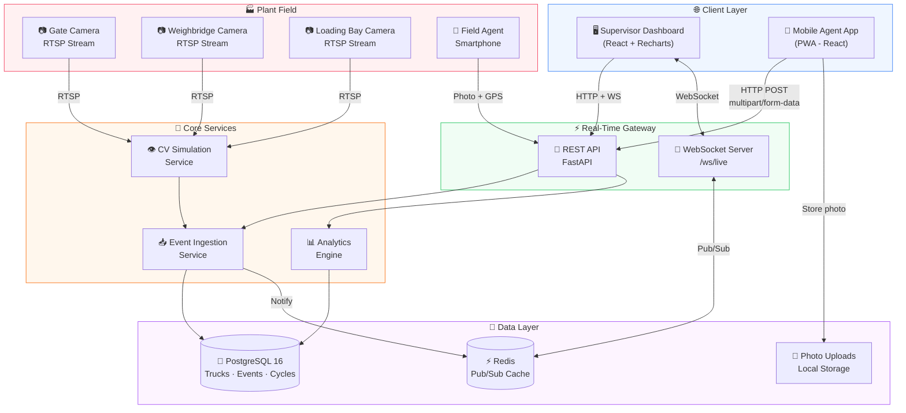
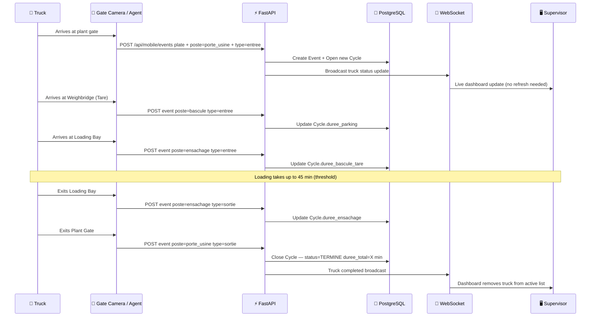
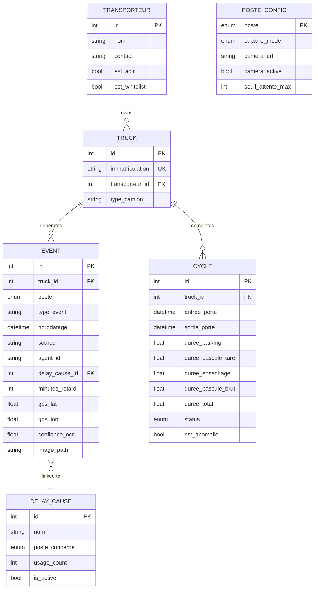

<div align="center">

# 🏭 Smart Plant Truck Tracker
### LafargeHolcim Meknès — Intelligent Logistics Platform

[](https://fastapi.tiangolo.com)
[](https://react.dev)
[](https://postgresql.org)
[](https://docker.com)
[](https://typescriptlang.org)

> **Every minute a cement truck waits inside your plant is money lost.**
> This system tracks every truck, at every gate, at every second — automatically.

</div>

---

## 🎯 What Problem Does This Solve?

At a cement plant like **LafargeHolcim Meknès**, dozens of trucks enter and exit every day. Each truck passes through **4 critical zones**:

```
🚪 Entry Gate  →  🅿️ Parking  →  ⚖️ Weighbridge  →  📦 Loading Bay  →  🚪 Exit Gate
```

Without a tracking system, supervisors have **no visibility** over:
- How long has this truck been waiting?
- Which zone is creating bottlenecks today?
- Which transport company causes the most delays?
- Why was truck `45231-A-12` late last Tuesday?

**This platform answers all those questions — in real time.**

---

## ✨ Key Features

### 🖥️ Supervisor Dashboard
- **Live truck tracking** via WebSocket — no page refresh needed
- Visual timeline of each truck's journey through the plant
- Real-time alerts for trucks exceeding waiting time limits
- Camera URL configuration per zone (Bi-Mode: OCR Camera + Mobile Agent)

### 📊 Statistics & Analytics
- Filter by **Today / Last 7 Days / Last 30 Days**
- Cycle time analysis: average, median, min, max vs. 120-min target
- **Zone-by-zone delay breakdown** with threshold compliance charts
- **Full cause-of-delay analysis** with progress bars and % of global delay
- Transport company performance ranking with cumulative delay minutes
- Data source breakdown: OCR Camera vs. Mobile Agent vs. Hybrid

### 📱 Mobile Agent Interface
- Field agents can log truck entries/exits from their **smartphone**
- Optional photo capture of license plates
- GPS geolocation attached to every event
- Report delays with cause selection + free text comment
- Works as a **Progressive Web App (PWA)** — installable on any phone

### 🤖 Bi-Mode Capture System

| Mode | Description | Best For |
|------|-------------|----------|
| **Camera OCR** | AI reads the license plate automatically | Normal conditions |
| **Mobile Agent** | Human agent confirms/enters plate manually | Dusty conditions |
| **Hybrid** | Camera attempts first, agent validates if unsure | Maximum reliability |

---

## 🏗️ System Architecture



---

## 🔄 Full Truck Lifecycle — Step by Step



---

## 🗃️ Database Schema



---

## 🛠️ Tech Stack

| Layer | Technology | Why |
|-------|-----------|-----|
| **Frontend** | React 18 + TypeScript | Fast, type-safe UI |
| **Charts** | Recharts | Beautiful, responsive data visualization |
| **Icons** | Lucide React | Clean, consistent icon set |
| **Styling** | Tailwind CSS | Rapid utility-first styling |
| **PWA** | Vite Plugin PWA | Mobile-installable, offline capable |
| **Backend** | FastAPI (Python) | Async, auto-documented REST API |
| **ORM** | SQLAlchemy 2 | Safe, powerful database queries |
| **Database** | PostgreSQL 16 | Reliable relational data storage |
| **Cache/Events** | Redis 7 | Real-time pub/sub broadcasting |
| **Real-Time** | WebSocket | Instant dashboard updates |
| **Deployment** | Docker Compose | One-command full stack launch |
| **Web Server** | Nginx (Alpine) | Lightweight static file serving |

---

## 🚀 Quick Start — Run in 3 Commands

### Prerequisites
- [Docker Desktop](https://www.docker.com/products/docker-desktop/) installed and running
- [Git](https://git-scm.com/) installed

### Installation

```bash
# 1. Clone the project
git clone https://github.com/samya818/smart-plant-truck-tracker.git
cd smart-plant-truck-tracker

# 2. Create environment file
cp .env.example .env

# 3. Build and launch everything
docker compose up -d --build
```

> ✅ That's it. All 5 services start automatically.

### Access the Application

| Interface | URL | Description |
|-----------|-----|-------------|
| 🖥️ **Supervisor Dashboard** | http://localhost | Main monitoring screen |
| 📊 **Statistics** | http://localhost/statistiques | Analytics & reports |
| 📱 **Mobile Agent** | http://localhost/mobile | Field agent interface |
| 🔧 **API Documentation** | http://localhost:8000/docs | Interactive API explorer |
| 🗄️ **Database Admin** | http://localhost:8080 | Adminer (DB browser) |

---

## 📁 Project Structure

```
smart-plant-truck-tracker/
│
├── 📂 backend/
│   └── app/
│       ├── main.py               # App entry point + startup seeding
│       ├── models.py             # SQLAlchemy database models
│       ├── schemas.py            # Pydantic request/response schemas
│       ├── config.py             # Settings & environment variables
│       ├── routers/
│       │   ├── analytics.py      # Statistics & reporting endpoints
│       │   ├── dashboard.py      # Live dashboard data
│       │   ├── mobile.py         # Mobile agent endpoints
│       │   └── events.py         # Event history
│       └── services/
│           ├── event_ingestion.py # Core business logic: cycle tracking
│           └── cv_service.py      # Camera simulation / OCR service
│
├── 📂 frontend/
│   └── src/
│       ├── pages/
│       │   ├── Dashboard.tsx          # Supervisor dashboard
│       │   ├── StatistiquesPage.tsx   # Analytics & statistics
│       │   └── MobilePage.tsx         # Mobile agent interface
│       ├── components/
│       │   ├── TruckCard.tsx          # Truck status card
│       │   ├── StatsChart.tsx         # Statistics charts
│       │   └── mobile/
│       │       └── AgentCapture.tsx   # Mobile capture form
│       ├── hooks/
│       │   ├── useWebSocket.ts        # WebSocket connection hook
│       │   └── useCamera.ts           # Camera capture hook
│       └── services/api.ts            # API call functions
│
├── docker-compose.yml
└── .env.example
```

---

## ⚙️ Environment Variables

```env
# Database
POSTGRES_USER=lafarge_user
POSTGRES_PASSWORD=your_strong_password
POSTGRES_DB=lafarge_tracker

# Application mode
CV_MODE=simulation          # "simulation" or "real"
SIMULATION_TRUCKS_PER_DAY=80

# Thresholds (minutes)
SEUIL_ATTENTE_PARKING_MAX=30
SEUIL_BASCULE_MAX=15
SEUIL_ENSACHAGE_MAX=45
SEUIL_CYCLE_TOTAL_MAX=120
```

---

## 🎬 How the Simulation Works

When `CV_MODE=simulation`, the backend automatically generates realistic truck traffic:

- **80 trucks/day** by default (configurable)
- Trucks arrive between **06:00 and 18:00**
- Each truck goes through all 4 zones with realistic durations
- Random delays and anomalies are injected (~15% of cycles)
- The dashboard updates live as trucks complete their journeys

> **This lets you test the full system without any physical cameras.**

To use real cameras, set `CV_MODE=real` in `.env` and configure RTSP URLs in the Dashboard → ⚙️ Configuration panel.

---

## 📈 Business Value

| Metric | Before | After |
|--------|--------|-------|
| Cycle visibility | ❌ None | ✅ Real-time per truck |
| Bottleneck detection | ❌ End-of-day report | ✅ Instant alert |
| Delay accountability | ❌ No data | ✅ Per carrier, per cause |
| Agent reporting | ❌ Paper forms | ✅ Smartphone in 10 seconds |
| Monthly statistics | ❌ Manual Excel | ✅ Auto-generated with charts |

---

## 👤 Author

**Samya** — Industrial IoT & Logistics Tracking
📍 LafargeHolcim Meknès, Morocco
🔗 [github.com/samya818](https://github.com/samya818)

---

<div align="center">

**Built with ❤️ for smarter industrial logistics**

*If this project helped you, consider giving it a ⭐ on GitHub*

</div>
